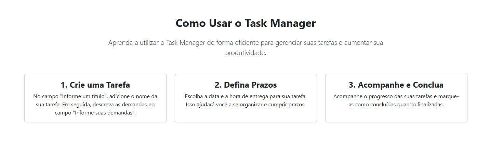
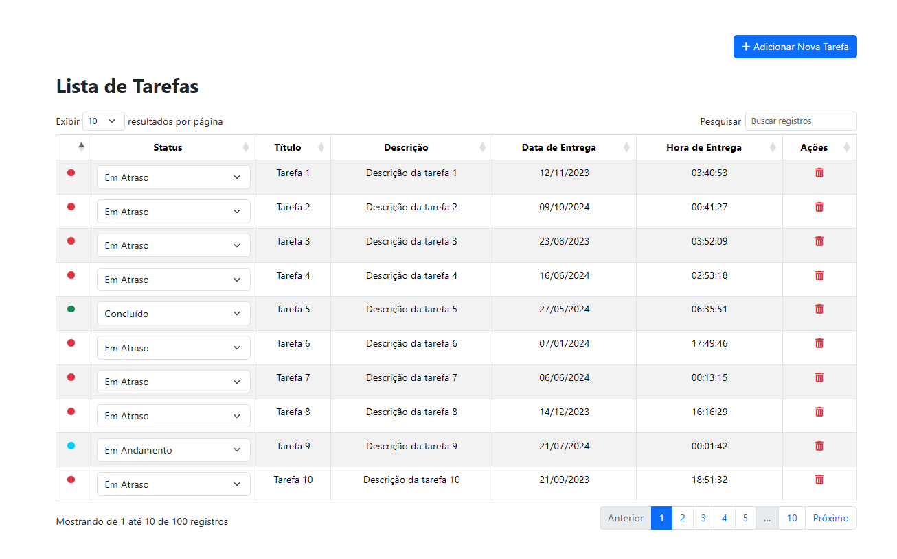

<h1 align="center">
  	Task Manager
</h1>
<p align="center">
  <b>Projeto de Teste</b></br>
  <sub> Objetivo: Desenvolver uma aplicação simples para gerenciar uma lista de tarefas utilizando
PHP procedural, MySQLi para conexão com o banco de dados, Bootstrap para o layout e jQuery
com AJAX para interações dinâmicas. 
<sub>
</p>

<a href="https://github.com/matheuszuge/task-manager-php/blob/master/.github/images/screenshot.png">
  
</a>

<a href="https://github.com/matheuszuge/task-manager-php/blob/master/.github/images/screenshot.png">
  
</a>

<a href="https://github.com/matheuszuge/task-manager-php/blob/master/.github/images/screenshot.png">
  
</a>

<a href="https://github.com/matheuszuge/task-manager-php/blob/master/.github/images/screenshot.png">
  
</a>

## **Dependências**

Para rodar o projeto, você precisará das seguintes dependências:

### 1. **PHP**

- Versão 7.4 ou superior.
- [Download PHP](https://www.php.net/downloads)

### 2. **Banco de Dados**

- MySQL ou MariaDB.

### 3. **Bibliotecas Front-end**

- **Bootstrap**: Framework CSS para estilização.
- **jQuery**: Biblioteca JavaScript para interações dinâmicas.

---

## **Instalação**

Siga os passos abaixo para configurar e rodar o projeto localmente:

### 1. **Clone o Repositório**

```bash
git clone https://github.com/matheuszuge/task-manager-php

cd task-manager-php

```

## 2. **Configure o Banco de Dados**

- Crie um banco de dados MySQL chamado task_manager.
- Adicione as credenciais do banco de dados no arquivo:
  database/migrations/migrate.php

## 3. **Execute as Migrações**

- No terminal, execute o seguinte comando para criar as tabelas no banco de dados:

php database/migrations/migrate.php

## 4. **Inicie o Servidor PHP**

- php -S localhost:8000
